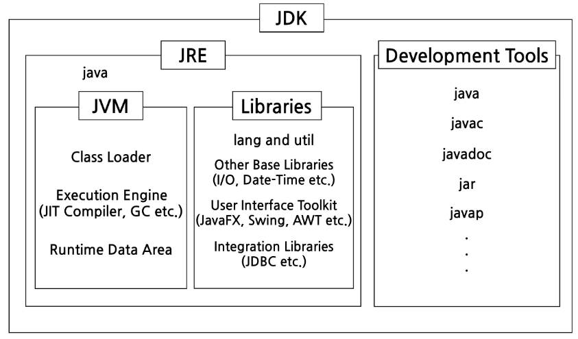
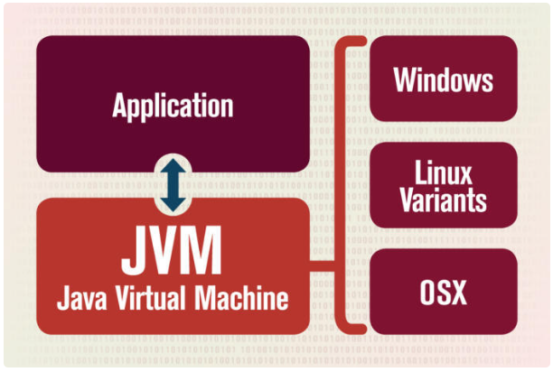
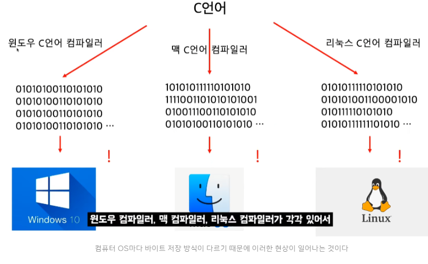
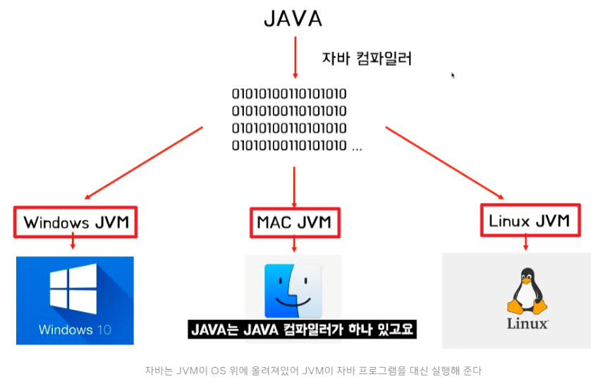
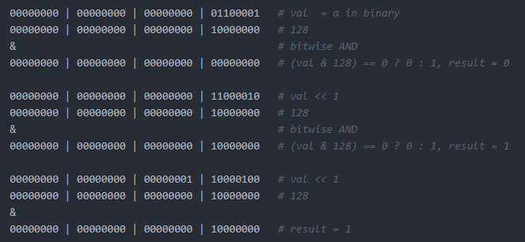
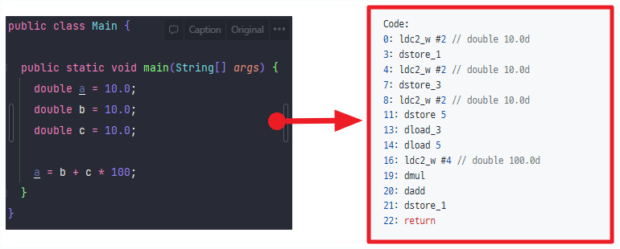
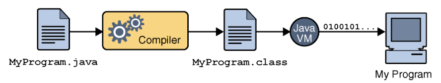

※ Java 프로그램을 개발 → JDK / Java 프로그램 실행 → JRE

### JDK (Java Development Kit)

- 자바로 개발하는데 사용되는 SDK
    - SDK (Software Development Kit)
        - 하드웨어 플랫폼, 운영체제 또는 프로그래밍 언어 제작사가 제공하는 툴
        - ex) 안드로이드 스튜디오
- 자바 개발 시 필요한 라이브러리, javac, javadoc 등 개발도구들이 포함
- 버전 표기
    - Java SE (Java Standard Edition)
        - 가장 기본적인 클래스 패키지
        - PC에 설치해 사용할 수 있는 모든 프로그램 개발
            - PC용 어플리케이션, 애플릿개발, 응용 프로그램 개발, 웹개발, 안드로이드 개발
    - Java EE (Java Enterprise Edition)
        - 대규모 기업용 데이션, SE 확장판
        - 기업환경을 위한 대규모 솔류션 개발, 모바일폰, 셋탑박스, 차량용 텔레매틱스 시스템 개발
    - Java ME (Java Micro Edition)
        - 피쳐폰, PDA폰, 셉톱박스, 프린터 같은 작은 임베디드 기기, 작은 기기를 다루는데 이용하는 에디션
        - SE를 라이트하게 만든 것
    - Java FX
        - 가볍고 예쁜 그래필 사용자 인터페이스 (GUI)를 제공하는 에디션
        - 고성능의 하드웨어 그래필 가속과 미디어 엔진 API를 제공해주어서 프로그램의 성능에 신경을 써야하는 분야에서 사용
- JDK 종류
    - Oracle JDK : Oracle에서 제공. 구독을 통해 유로 라이센스 구매 가능
    - Open JDK : Open JDK기반으로 빌드된 JDK 사용을 추천
    - Azul Zulu : 인지도가 높음. Max 에서 사용하는 바이너리 제공
    - Amazon Corretto : AWS에서 제공. AWS에서 쉽게 사용 가능
    - Temurin (AdoptOpenJDK) : Eclipse에서 제공
- bin 디렉터리에 들어 있는 개발 프로그램
    - javac : 자바 컴파일러. 자바 소스를 바이트 코드로 컴파일
    - java : 자바 인터프리터. 컴파일러가 생성한 바이트 코드를 해석하고 실행
    - javadoc : 자바소스로부터 HTML 형식의 API 도큐먼트 생성
    - jar : 자바 클래스 파일을 압축한 자바 아카이브 파일(.jar) 생성, 관리하는 압축 프로그램 (zip 파일 X)
    - jmod : 자바의 모듈 파일(.jmd)을 만들거나 모듈 파일의 내용 출력
    - jlink : 응용 프로그램에 맞춘 맞춤형 JRE 생성
    - jdb : 자바 응용프로그램의 실행 중 오류를 찾는데 사용하는 디비거
    - javap : 역어셈블러. 컴파일된 클래스 파일을 원래의 소스로 변환

### JRE (Java Runtime Environment)

- JVM과 자바 프로그램을 실행시킬 때 필요한 라이브러리 API를 함께 묶어서 배포되는 패키지
- 자바 런타임 환경에서 사용하는 프로퍼티 세팅이나 리소스 파일(jar 파일)을 가지고 있다.
- JRE는 기본적으로 JDK가 포함되어 있기에 JDK를 설치하면 함께 설치된다.
- JDK11 버전부터는 따로 제공 X

### JVM (Java Virtual Machine)

- 자바 가상머신
- 자바를 실행하는 프로그램
- 자바로 작성된 모든 프로그램은 JVM에서만 실행 가능.
- JVM은 JRE에 포함 → JRE가 설치되어 있다면 JVM도 설치가 되어 있다는 뜻.
- JVM은 자바 프로그램을 모든 플랫폼에서 제약없이 동작 가능
    
    
    

### JVM이 왜 필요한가?

- Java는 OS에 종속적이지 않다는 특징을 가지고 있다.
    - OS위에 Java를 실행시킬 무언가가 필요 → JVM
- C언어
    - 소스코드 → Binary Code(기계어) 변환 → 하드웨어
    - 개발자가 소스 코드를 작성하면, 기계에 맞춰진 컴파일러가 각 기계가 이해하는 기계어로 변환해주어 실행 프로그램으로 만든다. (WOCA : Write Once, Compile Anywhere)
    - 기계어는 특정 OS나 CPU 구조에 맞춰진 컴파일러에 의해 다르게 컴파일
        - 다양한 환경의 기기를 사용하는 환경에서는 해당 기계어를 이해 불가
    
    
    
- Java
    - 소스코드 → Byte Code → 기계어로 변환 (JVM 역할) → 바로 CPU 실행
    - Java로 작성한 소스파일은 직접 운영체제로 실행하는 것이 아닌 JVM을 거쳐 운영체제와 상호작용을 한다. (WORA : Write Once, Read Anywhere)
        - 운영체제로부터 독립적으로 프로그램을 제약없이 실행 가능
    - 컴파일된 코드와 하드웨어/OS 사이 중간에서 해당 하드웨어/OS에 알맞게 JVM이 Byte Code로 변환해주기 때문
    
    
    
    - JVM 과정
        - Java Compiler가 JAVA로 작성된 소스코드 .java파일은 .class파일인 Byte Code로 컴파일
        - Byte Code를 기계어로 변환시키기 위해 가상 CPU가 필요 ⇒ JVM의 역할
        - JVM이 Byte Code를 기계어 (Binary Code)로 변환
        - JVM에 의해 컴파일된 기계어는 바로 CPU에서 실행되어 사용자에게 서비스를 제공
        - 다른 언어 클래스 파일만 있다면 JVM 사용 하근ㅇ
            - 실제 Java 외 다른 언어(클로저, 그루비, 코틀린 등)도 JVM 사용

### 💡 Binary Code / Byte Code

- Binary Code
    - 컴퓨터가 인식하고 이해할 수 있는 0과 1로 구성된 코드
    - 환경에 종속적이며 실행하지 못한다.
    - 가장 기계어와 유사한 레벨의 코드지만 완전한 기계어는 아니다.
        - ‘링커’에 의해 메모리 주소값을 반영하고 CPU가 직접 해독하고 실행할 수 있도록 수정되어야 기계어가 되는 것이기 때문
    
    
    
- Byte Code
    - 가상머신 (JVM, CLR 등)에서 사용되는 코드 개념
    - 가상머신이 이해할 수 있는 중간 레벨로 컴파일 한 것
    - 어셈블리어와 유사한 형태
    - 실행되기 위해 컴파일러 (javac, csc.exe 등)에 의해 한번 더 변환되어야 한다.
    - Binary Code와 달리 어떠한 환경에 종속적이지 않고 실행 가능
    
    
    

### 단점

- JVM은 운영체제에 종속적이므로, 각 운영체제에 맞는 JVM을 설치해야한다.
- 상대적으로 실행속도가 느림
    - Java 프로그램은 일반 프로그램보다 자바 가상 머신이라는 한 단계를 더 거쳐야 하기 때문
    - 2번 컴파일 과정을 보완하기 위해 JIT 컴파일러 라는 내부 프로그램을 사용해 필요한 부분만을 기계어로 바꾸어 줌으로써 성능 향상을 가져왔다.
        - BUT, C언어의 실행속도를 따라잡지 못했다.

### 💡 JIT 컴파일러 (Just-In-Time compiler)

- 기존의 자바는 인터프리터 방식으로 명령어를 하나씩 실행하게끔 이루어져 있어 실행속도가 느렸다.
    - 하드웨어 발전으로 JIT 컴파일러 방식으로 개선되어 속도적인 측면에서 상당히 개선
- 같은 코드를 매번 해석하지 않고, 실행할 때 컴파일을 하면서 해당 코드를 캐싱 → 이후 바뀐 부분만 컴파일하고 나머지는 캐싱된 코드를 사용
- 동적 번역 (Dynamic Translation)이라고도 불림
    - 자바 해석기(Java Interpreter) 방식보다 성능이 10 ~ 20 배 정도 더 좋다.

### Java 프로그램 실행과정

1. 소스코드 (MyProgram.java) 작성
2. 컴파일러(Compiler)는 자바 소스코드를 이용해 클래스 파일 (MyProgram.class)을 생성
    1. 컴파일된 클래스 파일은 JVM이 인식할 수 있는 바이트 코드 파일
3. JVM은 클래스 파일의 Byte Code를 해석해 Binary Code로 변환하고 프로그램을 수행
4. MyProgram 수행결과가 컴퓨터에 반영

---
<aside>
💡 Reference

</aside>

- [https://inpa.tistory.com/entry/JAVA-☕-JDK-JRE-JVM-개념-구성-원리-💯-완벽-총정리](https://inpa.tistory.com/entry/JAVA-%E2%98%95-JDK-JRE-JVM-%EA%B0%9C%EB%85%90-%EA%B5%AC%EC%84%B1-%EC%9B%90%EB%A6%AC-%F0%9F%92%AF-%EC%99%84%EB%B2%BD-%EC%B4%9D%EC%A0%95%EB%A6%AC)