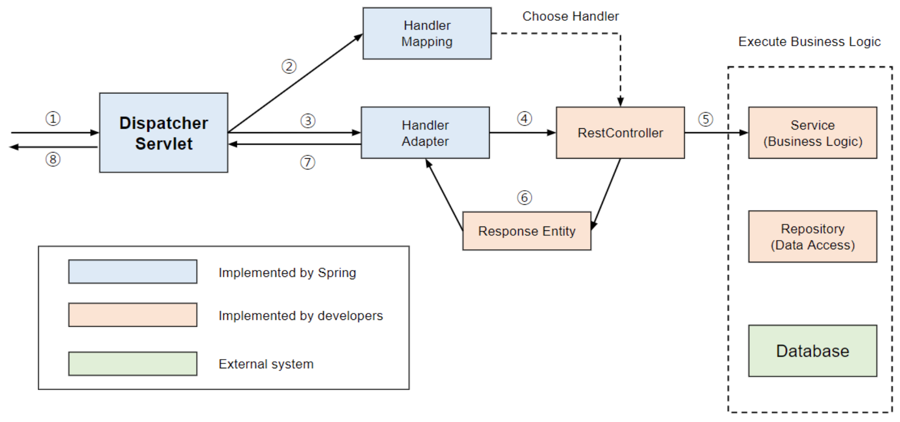
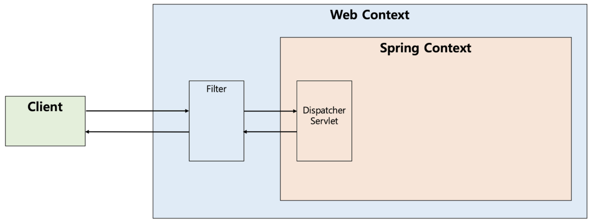
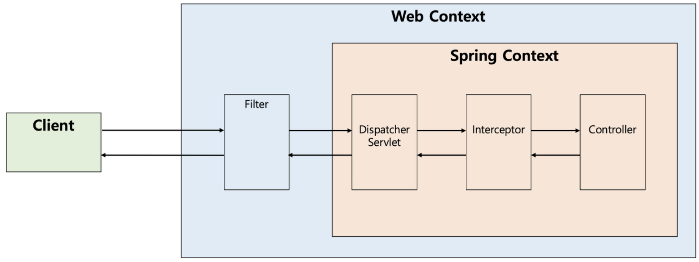
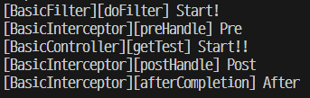
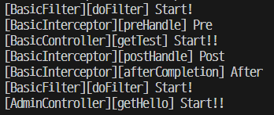

### 흐름도



1. Dispatcher Servlet (Front Controller)
    1. Client 요청을 받는다.
2. Spring (Handler Mapping, Handler Adapter) - Intercepter
    1. Spring이 내부적으로 요청을 Controller에 전달
    2. 어떤 Controller를 사용할 것인지 Mapping
    3. 전달할 Controller Mapping 하면 Adapter가 요청을 위임
3. RestController
    1. Spring이 Mapping 해준 요청을 받아서 Model 및 View에 전달
4. Execute Business Logic (Model)
    1. Database 처리 (CRUD)
        1. Business Logic (Service)
        2. Data Access (Repository) - DAO
        3. Database
5. Model에서 처리한 것을 Controller가 다시 받는다.
6. Controller는 Response를 View 및 Spring에 전달
    1. Handler Adapter
    2. View
7. 최종적으로 Dispatcher Servlet에 전달하여 사용자에게 뿌린다.

### Filter (@Component)



- Dispatcher Servlet에게 요청이 전달되기 전/후 데이터 점검
- 모든 Request와 Response를 처리한다.
- 요청 전
    - 알맞은 url 및 Input Data가 들어왔는지 확인
- 요청 후
    - 알맞은 Outpu Data가 Response을 주었는지 확인
- Filter Method
    - init() : Filter 객체 초기화
    - doFilter() : url 패턴에 맞는 모든 HTTP 요청이 Dispatcher Servlet에 전달 전 실행
        - FilterChain을 통해 다음 대상으로 요청을 전달
        - 전/후 필요한 처리 과정을 넣어줌
    - destory() : Filter 객체 제거 및 자원 반환
- Code
    
    ```java
    package com.example.basic.config.filter;
    
    import java.io.IOException;
    
    import org.springframework.stereotype.Component;
    
    import jakarta.servlet.Filter;
    import jakarta.servlet.FilterChain;
    import jakarta.servlet.ServletException;
    import jakarta.servlet.ServletRequest;
    import jakarta.servlet.ServletResponse;
    import lombok.extern.slf4j.Slf4j;
    
    // Component : Spring이 Filter로 인식
    // req, resp 둘다 처리하는 곳
    @Component
    @Slf4j
    public class BasicFilter implements Filter {
    
      @Override
      public void doFilter(ServletRequest request, ServletResponse response, FilterChain chain)
              throws IOException, ServletException {
        log.info("[BasicFilter][doFilter] Start!");
        
        // chain을 통해 req, resp를 묶어준다.
        chain.doFilter(request, response);
      }
    }
    ```
    
    
    

### Interceptor (@Component) / InterceptorConfig (@Configuration)



- Filter와 비슷한 역할
- Dispatcher Sevlet (Front Controller)이후 Controller에 도달하기 전에 데이터 점검
- Intercepter Method
    - preHandle() : Request
        - Controller가 호출 전 실행
        - 전처리 작업 및 요청 정보 가공, 추가
    - postHandle() : Response
        - Controller 호출 후 실행
        - 후저리 작업
    - atferCompletion() : preHandle, postHandle 완료후 확인
        - 모든 view에서 최종 결과를 생성하는일 포함 모든 작업 완료된 후 실행
- ⭐ InterceptorConfig (WebMvcConfig 생성)
    - Interceptor를 사용할 경우 Config 파일 생성
    - 모든 Request와 Response를 처리할 수도 있고 안할 수도 있다.
        - 각 Controller별 Inserceptor를 만들 수 있다.
            - Controller별 특징에 맞게 정의
            - Ex) AdminController에 가기전 AdminInterceptor가 계정권한 확인
- 기본
    
    ```java
    package com.example.basic.config;
    
    import org.springframework.context.annotation.Configuration;
    import org.springframework.web.servlet.config.annotation.InterceptorRegistry;
    import org.springframework.web.servlet.config.annotation.WebMvcConfigurer;
    
    import com.example.basic.config.interceptor.BasicInterceptor;
    
    // WebMvcConfigurer를 사용하기 위한 설정
    @Configuration
    public class WebMvcConfig implements WebMvcConfigurer{
        @Override
        public void addInterceptors(InterceptorRegistry registry) {
            // WebMvcConfigurer.super.addInterceptors(registry);
            registry.addInterceptor(new BasicInterceptor())
                    .addPathPatterns("/**"); // "/**" : 모든 url
        }
        
    }
    ```
    



- excludePathPatterns
    
    ```java
    package com.example.basic.config;
    
    import org.springframework.context.annotation.Configuration;
    import org.springframework.web.servlet.config.annotation.InterceptorRegistry;
    import org.springframework.web.servlet.config.annotation.WebMvcConfigurer;
    
    import com.example.basic.config.interceptor.BasicInterceptor;
    
    // WebMvcConfigurer를 사용하기 위한 설정
    @Configuration
    public class WebMvcConfig implements WebMvcConfigurer{
        @Override
        public void addInterceptors(InterceptorRegistry registry) {
            // WebMvcConfigurer.super.addInterceptors(registry);
            registry.addInterceptor(new BasicInterceptor())
                    .addPathPatterns("/**") // "/**" : 모든 url
                    .excludePathPatterns("/admin/**"); // 제외 : admin으로 들어온 것은 Interceptor 적용 X
        }
        
    }
    ```
    



### 폴더구조


<aside>
💡 Reference

</aside>

- https://mangkyu.tistory.com/173