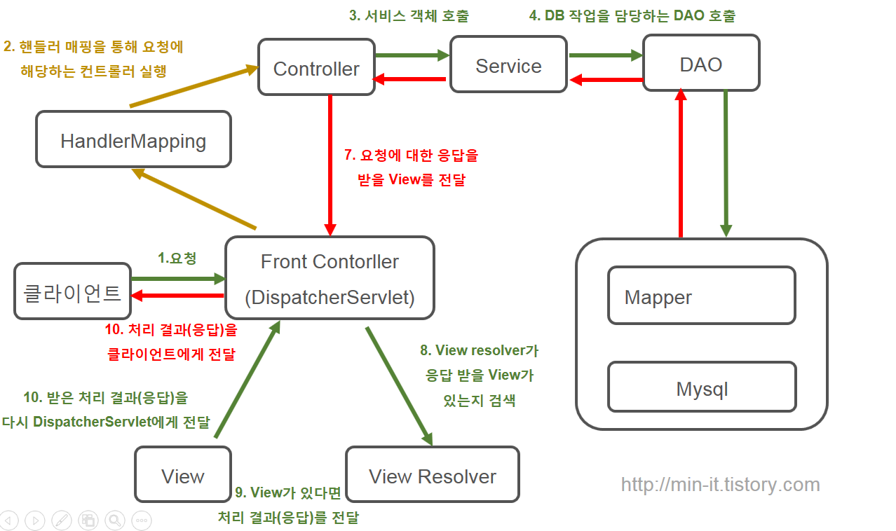
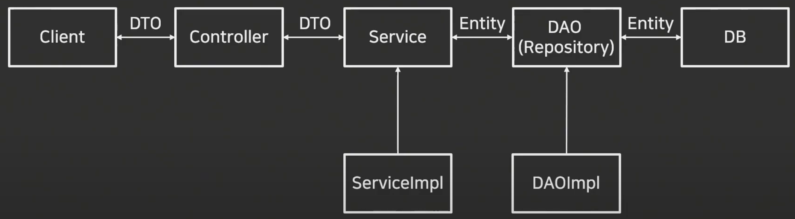
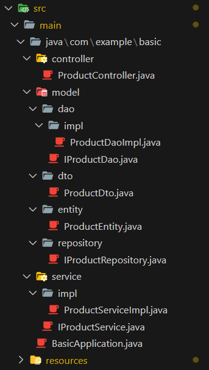

### ORM (Object Relational Mapping)

- Query를 사용하지 않고 Java를 사용해서 구현 가능
- JPA
    - Java 뿐만 아니라 SQL도 사용할 수 있도록 함
- 복잡한 Query는 사용하기 힘들다
    - 상황에 맞춰서 선택해서 사용

### JPA (Java Persistance API)

- 모듈
- DTO
    - Client와의 소통을 위한 객체
    - DB Table Join 표현 → Clinet 화면 설계하기 위해 사용
    - Client ↔ Controller
    - Controller ↔ Service
- DAO (Repository)
    - Java 객체가 DB에 접근할 수 있도록 해주는 연결다리
- Entity
    - DB와의 소통을 위한 객체
    - 각각의 DB Table
    - Service ↔ DAO
    - DAO ↔ DB
- Hibernate
    - ORM Framework
    - JPA에서 가장 많이 사용
- Spring Data JPA
    - Spring Framework에서 JPA를 편하게 사용하게 해주는 라이브러리
    - CRUD 처리용 인터페이스 제공
    - 인터페이스만 작성하면 구현 객체를 동적으로 생성해서 주입

### JPA 구조

- yml 파일 설정
- entity
    - DB 데이터 담는다.
- dto
    - controller에서 데이터를 받는다.
- repository
    - Service와 DB 연결
    - CRUD 정의
    - interface
    - extends JpaRepository<{Entity class}, {PK type}>
- dao
    - interface
    - dao(impl)
        - @Service
        - @Autowired : IRepository
- service
    - interface
    - service(impl)
        - @Service
        - @Autowired : IDAO
- controller
    - @Autowired : IService

### JPA Query Method

- 메소드 이름으로 쿼리 생성을 하는 쿼리 메소드 기능 제공
- Entity를 활용해 메소드명을 지정해 쿼리생성 가능

<aside>
💡 Reference

</aside>

- Query Method
    - https://velog.io/@seongwon97/Spring-Boot-Query-Method