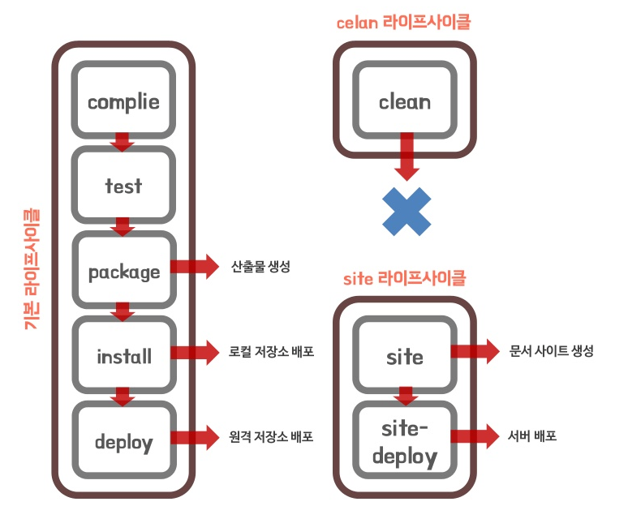
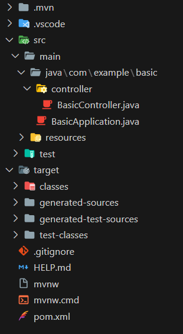
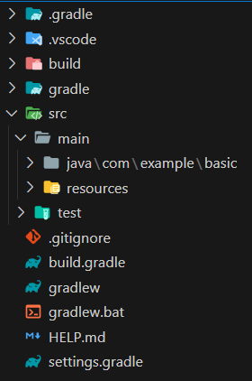

💡 C#에서 NuGet 

💡 python 에서의 pip

## Maven

- Java 프로젝트에서 라이브러리 의존성 관리 및 빌드 자동화
- 일관적 사용 및 간단한 설정을 통해 배포관리
- (Project Object Model)pom.xml 에서 작성
- 단점
    - 오류 찾기가 어렵다.

### Maven Life-Cycle

- java 파일 → class 파일 : compile
- 단위 테스트 : test
- package → jar 및 war 파일로 압축 : package
- 배포 : deploy

### jar vs war

- jar
    - 패키징 안에 서버도 같이 넣어서 할 경우
- war
    - tomcat이 읽을 수 있다.

### Maven 폴더구조

- main
    - 실제 코드 작성
- main/java
    - java 코드
    - Controller : Servlet
- main/resources
    - java가 아닌 다른 resource 파일
- main/resources/static
    - css, img, JS 파일
- main/resources/templates
    - View : HTML
- main/resources/application.properties
    - 설정관련 파일
- test
    - build

## Gradle

- build.gradle
    - Maven에서 pom.xml

### Gradle 폴더구조

