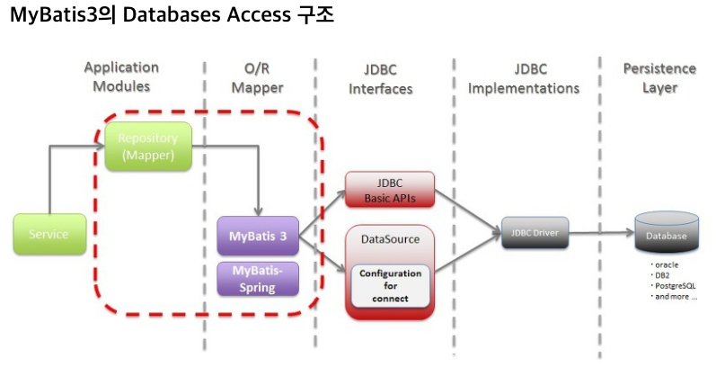
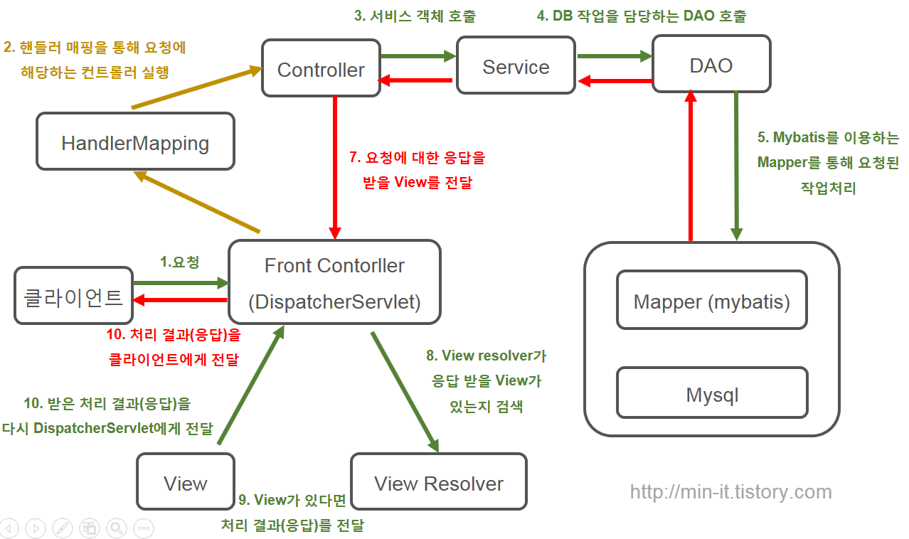
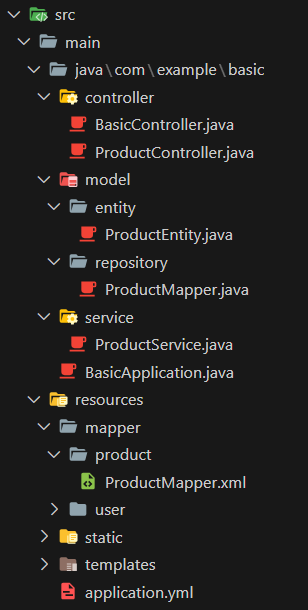

- SpringBoot가 MySQL을 쉽게 접속할 수 있게 해주는 모듈

### MyBatis Databases Access 구조



1. Application Modules
    1. Spring
2. O/R Mapper (MyBatis3, MyBatis Spring)
    1. MyBatis가 이해할 수 있는 언어로 변환
3. JDBC Interfaces
    1. JDBC Connection
    2. DB에 접속할 수 있도록 
4. JDBC Driver
5. Database
    1. MySQL, Oracle, PostgreSQL

### MyBatis 설정

- application.properties = application.yml 변경

```yaml
# Sping Boot 설정
spring:
    # Spring Boot Log
    output:
        ansi:
            enabled: always

    # Database(MySQL) 설정
    datasource:
        driver-class-name: com.mysql.jdbc.Driver
        url: jdbc:mysql://localhost:3306/examplesdb?userSSL=false&allowPublicKeyRetrieval=true&serverTimezone=Asia/Seoul
        username: urstory
        password: u1234

# MyBatis 설정
mybatis:
  # default Package location - resultType의 Alias를 지정합니다. (결과 타입 폴더명)
  type-aliases-package: com.example.basic.model.entity
  # mapper location - 바라 볼 xml 파일을 지정합니다. (classpath : resources 경로)
  mapper-locations: classpath:mapper/**/*.xml
  # column name to camel case - 반환 받는 컬럼명을 CamelCase로 받는 설정을 합니다.
  configuration:
    map-underscore-to-camel-case: true
```

### ⭐ MVC 구조



1. Client 요청
2. Filter
3. Dispatcher Servlet (Front Controller)
    1. Client 모든 요청을 받는다.
4. Interceptor
5. Handler Mapping
    1. 요청에 알맞은 Controller 선택
6. Controller
    1. Client 요청 처리
    2. 요청에 알맞은 Service 객체 호출
7. Service
    1. Business Logic
    2. DAO 객체 호출
8. DAO
    1. Mapper를 통해 요청 작업을 처리
    2. 직접적인 CRUD
9. Mapper
    1. 요청 작업 처리 (query 실행)
10. DB
    1. 데이터 처리
11. Mapper
    1. 응답을 DAO에 반환
12. DAO
    1. Mapper에서 받은 결과를 Service에 반환
13. Service
    1. Business Logic
    2. DAO의 응답을 가공하거나 조합해서 Client 요청에 적절한 데이터를 반환
    3. DAO의 응답을 Controller에 반환
14. Controller
    1. 응답을 View Resolver를 이용해 전달받을 View가 있는지 탐색
15. View Resolver
    1. 전달받은 View가 있다면 View에게 응답을 전달
16. View
    1. 응답을 Dispatcher Servlet (Front Controller)에 전달
17. Client 응답
    1. 응답을 잘 받았다는 것을 다시 Dispatcher Servlet에게 전달

### Controller와 Model 연결

- Conroller는 Service와 Service는 Mapper와 연결되어야 한다.

```java
// Controller와 Service 연결
@Autowired
private ProductService productService;

// Service와 Mapper 연결
// comfile 될 때 instance화 > Service가 만들어질때 같이 만들어짐
@Autowired
private ProductMapper productMapper;
```

### Mapper.xml

```xml
<?xml version="1.0" encoding="UTF-8" ?>
<!DOCTYPE mapper PUBLIC "-//mybatis.org//DTO Mapper 3.0//EN" "http://mybatis.org/dtd/mybatis-3-mapper.dtd">

<!-- namespace의 최종 파일은 xml과 동일한 이름으로 작성하는 것을 추천 -->
<mapper namespace="com.example.basic.model.repository.ProductMapper">
  <select id="selectProductAll" resultType="ProductEntity">
    SELECT
      product_id
      , product_name
      , product_price
    FROM product
    WHERE 1=1
    ;
  </select>
</mapper>
```

- mapper namespace
    - Mapper가 존재하는 경로
- select id
    - query를 호출하는 Method명
- select resultType
    - query 결과가 매핑되는 Model
    - 주로 결과가 단일 객체인 경우 사용

### 폴더구조



<aside>
💡 Reference

</aside>

- [https://velog.io/@java_master/Spring-MVC-기본-구조](https://velog.io/@java_master/Spring-MVC-%EA%B8%B0%EB%B3%B8-%EA%B5%AC%EC%A1%B0)
- [https://khj93.tistory.com/entry/MyBatis-MyBatis란-개념-및-핵심-정리](https://khj93.tistory.com/entry/MyBatis-MyBatis%EB%9E%80-%EA%B0%9C%EB%85%90-%EB%B0%8F-%ED%95%B5%EC%8B%AC-%EC%A0%95%EB%A6%AC)
- ⭐ https://adjh54.tistory.com/65